# ENTR 410 — Video Game Entrepreneurship
## Comprehensive Study Guide
### Chapters 7 · 8 · 11 · 13 · 14 · 15 · 17 · 19 · 20

---

## Master Mind Map — How All Chapters Connect

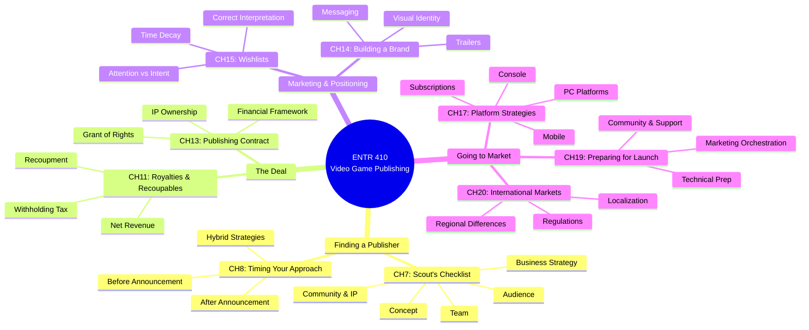

---

# Chapter 7 — The Scout's Checklist

> **Core Argument:** Publishers need a structured, repeatable framework to evaluate games. Success comes from managing a portfolio of games, not chasing single hits. Five key evaluation areas form the checklist: Concept, Development Team, Target Audience, Business Strategy, and Community/IP.

---

## Full Slide Content

### Overview
- Publishing is not about chasing single hit games → Long-term success comes from building and managing a portfolio of games rather than relying on one successful title
- Surface indicators can be misleading → Metrics such as wishlists, hype, or social media attention do not reliably predict success on their own
- A structured evaluation approach is essential → Publishers need a consistent framework to make better decisions
- Five key evaluation areas → Concept, development team, target audience, business strategy, and community

### Concept is King
- The core idea is the foundation of success → A strong concept determines whether players will be interested in the game at all
- Differentiation is critical → The game must stand out clearly in a crowded and competitive market
- Alignment with player motivations → The concept should satisfy specific player needs such as competition, creativity, or social interaction
- More than just novelty → The idea must not only be new but also meaningful and appealing to players

### Evaluating the Concept
- Clarity of the idea → Players should immediately understand what the game is about
- Originality and uniqueness → The game should offer something distinct compared to existing titles
- Evidence of early interest → Indicators such as wishlists or engagement suggest the concept resonates with players
- Long-term relevance → The idea should remain attractive by the time the game is released
- Timing within the market → Entering a trend too early or too late can significantly impact success

### The Development Team
- Execution determines outcomes → Even the best ideas fail without a capable team to deliver them
- Technical expertise → The team must have the skills to build the game effectively
- Creative vision → The team must be able to design an engaging and coherent experience
- Project management discipline → The team must be able to manage time, resources, and scope efficiently

### Evaluating the Development Team
- Game Design Document quality → A strong document reflects structured thinking and planning
- Systems understanding → Demonstrates knowledge of gameplay mechanics and technical implementation
- Content planning → Shows how art, story, and game elements will be developed
- Realistic timeline → Indicates whether the team understands development constraints
- Track record and reliability → Past experience helps demonstrate the ability to complete projects

### Understanding the Target Audience
- No single "average gamer" exists → The market is divided into many different player segments
- Clear target audience definition → Developers must know exactly who their game is designed for
- Psychographic understanding → Focus on player motivations, behaviors, and preferences rather than just demographics
- Guides development decisions → Audience understanding influences gameplay, design, and marketing

### Evaluating Audience Fit
- Clear identification of the target player → The development team can precisely describe their intended audience
- Alignment of gameplay mechanics → Game systems match what the target audience enjoys
- Appropriate presentation style → Visuals, sound, and interface appeal to the intended players
- Evidence of early audience connection → Initial engagement shows the game resonates with its audience

### Business Strategy
- Monetization approach → The game must have a clear plan for generating revenue
- Pricing strategy → The price should reflect the value and expectations of the target market
- Competitive awareness → Understanding similar games helps position the product effectively
- Marketing readiness → Awareness of how the game will be promoted and communicated to players

### Content Roadmap
- Structured development stages → Pre-Alpha, Alpha, Beta, and final release define progress
- Clear milestones and deliverables → Each stage should have measurable goals
- Post-launch planning → Updates and additional content extend the life of the game
- Expansion opportunities → Planning for future content increases long-term revenue potential

### Community and Intellectual Property Strategy
- Early community building → Developers should start engaging players as early as possible
- Active interaction with players → Engagement builds loyalty and provides valuable feedback
- Quality of community matters more than size → A small but engaged audience is more valuable than a large passive one
- Intellectual property potential → The game should have the ability to expand into franchises, additional content, or other media

### Publisher Decision-Making
- Perfect projects are rare → Most games have both strengths and weaknesses
- Balancing trade-offs → Publishers must decide which risks are acceptable
- Publisher support role → Publishers add value by strengthening weak areas
- Judgment and experience are essential → Frameworks guide decisions, but intuition still plays an important role

---

## Mind Map — The Scout's Checklist

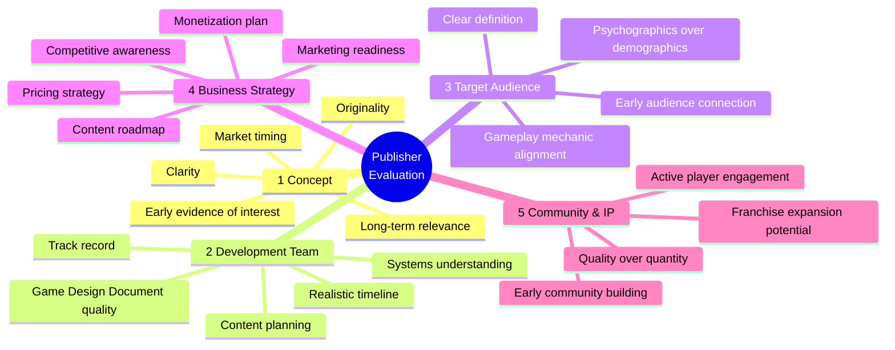

---

## Key Process — Evaluation Flow

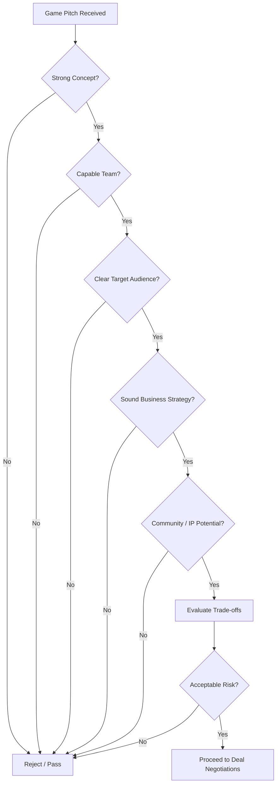

---

## Quick-Reference Summary Table

| Evaluation Area | Key Question | Green Flag | Red Flag |
|---|---|---|---|
| **Concept** | Is the idea clear and unique? | Immediate clarity + distinct niche | Vague or derivative |
| **Team** | Can they execute? | Strong GDD + track record | No prior shipped games |
| **Audience** | Do they know who they're making this for? | Specific psychographic profile | "Everyone" as the audience |
| **Business Strategy** | Is there a viable revenue plan? | Clear monetization + competitive awareness | No pricing or marketing plan |
| **Community/IP** | Can this grow beyond one game? | Active early community + franchise potential | No community presence |

---

## Study Examples

**Example 1 — Evaluating a Hypothetical Indie RPG**
- *Studio:* 3-person team, first game, inspired by Stardew Valley
- **Concept:** Clear — cozy farming RPG with town-building. Score: ✅
- **Team:** Weak GDD, no shipped games, but strong prototypes. Score: ⚠️
- **Audience:** "Cozy gamers, 18–35, who play Stardew" — very specific. Score: ✅
- **Business Strategy:** $15 price point, Steam release, no marketing budget. Score: ⚠️
- **Community/IP:** 200-follower Twitter, Discord started. Score: ⚠️
- *Publisher decision:* Risky but worthwhile if publisher can supply marketing and milestone structure.

**Example 2 — When to Reject Despite Hype**
- A game has 50,000 wishlists but the team has never shipped anything, has no GDD, and cannot define their target audience.
- The Scout's Checklist reveals: surface metrics (wishlists) look great, but three of five areas fail.
- Publisher should pass — the evaluation framework prevents being fooled by attention alone.

---

# Chapter 8 — Timing Your Approach to a Publisher

> **Core Argument:** When you approach a publisher is a strategic business decision, not just a milestone. Timing before vs. after public announcement creates fundamentally different negotiation dynamics, levels of control, and risk exposure. Neither is automatically better — it depends on your game, team, and goals.

---

## Full Slide Content

### Overview
- Timing is a strategic decision → It affects negotiation power, control over the narrative, and perceived risk
- Before vs after announcement matters → The same game is evaluated differently depending on timing
- Impacts leverage and flexibility → Early timing allows more negotiation options
- No single correct approach → The best choice depends on the game, team, and goals

### Why Timing Matters
- Before announcement: evaluated as an idea → Publishers focus on potential and future possibilities
- After announcement: evaluated as evidence → Publishers rely on market data and early performance
- Narrative control shifts → Developers control the story early, but lose control once public
- Market perception influences decisions → Public opinion becomes part of the evaluation

### The Role of Information Asymmetry
- Information imbalance creates leverage → One side having more control increases negotiation power
- Before announcement: developer controls information → The team decides what to show and how to present it
- Unknowns remain flexible → Gaps are seen as opportunities, not failures
- After announcement: market shares control → Public signals influence perception and valuation

### Before Announcement (Advantages)
- Greater control over positioning → Developers define how the game is presented
- Higher flexibility in negotiations → More deal structures are possible (for example, phased funding or hybrid partnerships)
- Focus on potential and vision → Publishers evaluate what the game could become
- Stronger publisher engagement → Early involvement creates a sense of ownership and commitment

### Before Announcement (Risks)
- Faster rejection is possible → Lack of public validation can make decisions quicker
- Requires strong clarity of vision → Developers must clearly explain concept, scope, and audience
- Risk of premature influence → External feedback may disrupt early development direction
- Less external proof → The project relies more on belief than evidence

### After Announcement (Advantages)
- Market validation is visible → Wishlists, engagement, and feedback provide evidence
- Reduced uncertainty for publishers → Strong signals make approval easier
- Potential for better terms → High demand can increase leverage and preserve creative control
- Momentum can attract interest → Public attention creates urgency for publishers

### After Announcement (Risks)
- Perception becomes fixed → Early impressions are difficult to change later
- Reduced flexibility → Adjusting strategy becomes harder due to public expectations
- More conservative deal structures → Publishers may offer stricter terms to manage risk
- Weak signals are harmful → Poor early performance is harder to recover from than no data

### The Hidden Cost of Going Public Early
- Expectation debt develops → Players form assumptions about the game's direction and quality
- Early materials become commitments → Screenshots, trailers, and descriptions shape expectations
- Changes become difficult → Adjustments create friction and require explanation
- Development becomes public accountability → Normal iteration is now visible and judged externally

### The Publisher's Internal Perspective
- Before announcement: focus on vision and upside → Decisions are driven by creativity and potential
- After announcement: focus on metrics and risk → Data and comparisons influence decisions
- Authorship vs accountability → Early projects feel like discoveries, later ones feel like responsibilities
- Different publisher types behave differently → Some focus on funding, others on marketing and services

### Timing as a Signal
- Early approach signals collaboration → Shows openness to partnership and shared development
- Late approach signals independence → Shows confidence and desire to validate the game first
- Publishers interpret behavior → Timing reflects how the team manages risk and decision-making
- Both choices have trade-offs → Each timing sends both positive and negative signals

### Hybrid Strategies
- Private outreach under confidentiality agreements → Developers gather feedback without public exposure
- Controlled visibility → Limited demos or festival participation create signals without full commitment
- Partner before public reveal → Secure a publisher first, then announce strategically
- Soft signaling through platforms → Early pages or previews provide feedback without full exposure

### When Not to Approach a Publisher
- Publisher involvement is optional → Not all projects require external support
- Strong internal capability reduces need → Teams with funding and expertise may not benefit
- Revenue sharing is costly → Giving up a percentage of income must be justified
- Focus on value added → Developers should ask what problem the publisher actually solves

### Final Insight — Timing as a Business Decision
- Timing is not just a milestone → It is a strategic business choice
- Announcements shape perception and value → Public exposure affects negotiation terms
- Sequence of actions matters → Announcements, demos, and pitches should be planned together
- Control is a key advantage → Managing when and how information is shared preserves leverage

### Key Takeaway for Developers
- Think strategically about timing → Do not treat announcements as automatic steps
- Understand trade-offs clearly → Visibility increases credibility but reduces flexibility
- Protect optionality when possible → Early stages offer more negotiation power
- Decide intentionally → Timing communicates how your team thinks and operates

---

## Mind Map — Timing Your Approach

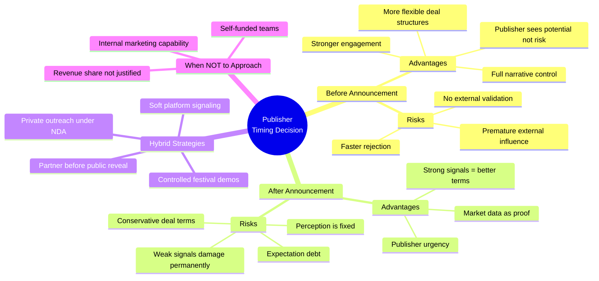

---

## Decision Tree — Should I Approach a Publisher Now?

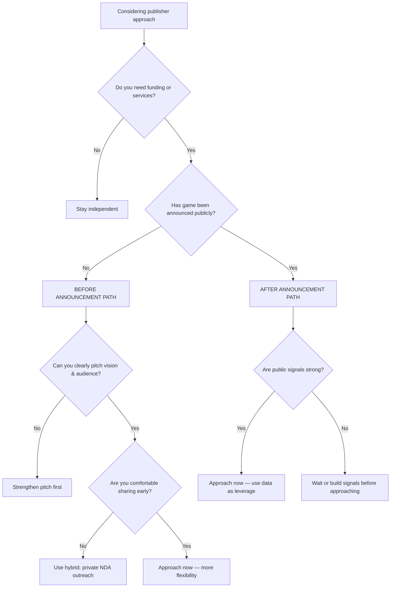

---

## Quick-Reference Summary Table

| Factor | Before Announcement | After Announcement |
|---|---|---|
| **Information control** | Developer controls | Market controls |
| **Publisher mindset** | Vision & potential | Metrics & risk |
| **Negotiation flexibility** | High | Lower |
| **Speed of rejection** | Faster (no proof) | Slower (data needed) |
| **Expectation debt** | None | Can be significant |
| **Best for** | Teams wanting co-development | Teams with strong early traction |

---

## Study Examples

**Example 1 — Small Studio, Unannounced Game**
- A 4-person team has a strong GDD for a roguelike platformer. No announcement, no social media presence.
- Best path: approach publishers *before* announcement using a hybrid strategy — share under NDA at PAX Dev, gather feedback from 2-3 publishers, secure a deal, *then* announce publicly.
- Why: maximum flexibility, publisher becomes a creative partner, no expectation debt yet.

**Example 2 — Studio with 30K Wishlists After Steam Next Fest**
- A game went viral in a Steam Next Fest demo. 30K wishlists, strong press coverage.
- Best path: approach publishers *now* using the data as leverage.
- Use momentum to negotiate better revenue splits and preserve creative control.
- Risk: if publisher negotiations drag on for months, momentum fades.

---

# Chapter 11 — Understanding Royalties and Recoupables

> **Core Argument:** The financial structure of a publishing deal — not just the advance — determines how much developers actually earn and when. Royalties (revenue share) and recoupables (costs recovered before royalties flow) can make a commercially successful game feel financially disappointing if not understood and negotiated carefully.

---

## Full Slide Content

### Overview
- Financial structure is the foundation of publishing partnerships → Creative vision matters, but the financial agreement often determines whether both sides view the deal as successful
- Money flow after release is critical → A game may perform well commercially, yet the developer may still earn less than expected depending on contract terms
- Royalties and recoupables shape long-term outcomes → These mechanisms determine how revenue is shared and when developers actually receive income
- Developers must understand the financial framework → This knowledge is not only for accountants, but for anyone involved in publishing deals

### What Royalties Mean
- Royalties are the developer's share of revenue → They represent the percentage of net revenue earned from game sales
- Royalties are based on net revenue, not gross revenue → The calculation begins after deductions such as platform fees and taxes
- The concept seems simple but is often misunderstood → Small details in calculation methods can significantly affect the developer's final income
- Royalties are the main reward for the developer's work → They are the primary financial return once the game is in the market

### Net Revenue and Deductions
- Net revenue is what remains after deductions → It is not the same as the full amount paid by players
- Platform fees reduce revenue first → Major platforms such as Steam, PlayStation, Xbox, and Nintendo typically take a significant share
- Additional costs further reduce the pool → Payment processing, refunds, chargebacks, and taxes all lower the amount available for royalties
- Developers must understand what is deducted → A royalty percentage may sound strong on paper, but deductions can greatly reduce actual earnings

### Why Royalty Payments Matter So Much
- Timely payment is a publisher's most important duty → Paying royalties correctly and on time is central to trust in the partnership
- The publisher acts like a financial custodian → The publisher temporarily holds funds that ultimately belong to the developer
- Delays damage confidence immediately → Late or unclear payments make developers question the publisher's reliability
- Financial trust affects future relationships → A publisher's reputation for payment accuracy strongly influences future partnerships

### How Royalty Reporting Usually Works
- Royalty reporting often follows a regular cycle → Most agreements use quarterly reporting because major platforms also report on that schedule
- Monthly reporting may exist, but payments are often quarterly → This reduces administrative burden while keeping financial tracking organized
- Publishers receive platform reports first → They gather sales data, calculate deductions, and determine the developer's share
- Developers then receive statements and payment → This creates a formal process for verification, invoicing, and transfer of funds

### Accountability and Tracking Infrastructure
- Publishers need systems to track revenue accurately → Good infrastructure reduces mistakes and improves transparency
- Large publishers often use integrated financial systems → These systems automate reporting, currency conversion, and royalty calculation
- Smaller publishers may rely on manual tools → Spreadsheets and separate accounting systems increase the risk of delays or errors
- Transparency becomes even more important when systems are weak → Developers need clear documentation to verify calculations

### Transparency in Royalty Statements
- Publishers should provide clear royalty statements → Statements should show gross revenue, deductions, net revenue, and the resulting royalty amount
- Developers should be able to verify the data → Redacted platform reports help confirm that the numbers are accurate
- Cross-checking builds financial trust → Transparency reduces suspicion and strengthens long-term collaboration
- Good documentation protects both parties → It helps with accounting, tax records, and future audits

### Why Royalty Management Reflects Publisher Quality
- Royalty handling shows operational competence → Accurate reporting and payment demonstrate professionalism
- It also reflects integrity → Transparency signals that the publisher treats developers as partners, not just suppliers
- Reputation spreads quickly in the industry → Developers talk about which publishers are trustworthy with money
- Financial reliability can become a competitive advantage → Smaller publishers may win good projects by being more transparent and dependable

### What Recoupables Are
- Recoupables are costs recovered before full royalties flow to the developer → They delay when the developer receives their full revenue share
- They allow publishers to recover investment → The publisher offsets certain approved expenses against revenue
- Recoupables affect timing, not only percentages → A strong royalty split may still produce little immediate income if recoupable costs are high
- Developers must understand which costs are recoupable → This determines how long it takes before full royalty payments begin

### Main Categories of Recoupable Costs
- Production costs → These include development funding, milestone payments, contractor fees, and technology licenses
- Technical costs → These include certification, localization, quality assurance, and platform porting
- Marketing and public relations costs → These include advertising, influencer campaigns, trade show appearances, and promotional work
- Distribution costs → These include physical production or territory-specific costs required for market access

### How Recoupment Works in Practice
- Revenue split may change until costs are recovered → The publisher may temporarily keep a larger portion of revenue
- Example: temporary higher publisher share → A contract may start with a more publisher-favorable split until recoupable expenses are covered
- After recoupment, the normal royalty rate begins → Once approved costs are recovered, the standard revenue-sharing arrangement applies
- This directly affects developer cash flow → A game can seem successful publicly while the developer still waits for meaningful income

### Transparency and Control Over Recoupables
- Responsible publishers document recoupable costs clearly → Expenses should be itemized, not hidden inside broad categories
- Developers should be able to review expenses → Visibility helps ensure funds are used reasonably and according to agreement
- Approval mechanisms are important → Large expenses should often require mutual consent
- Poorly controlled recoupables can delay developer earnings → Without limits, the publisher may wait much longer to benefit from sales

### Withholding Tax in International Publishing
- Withholding tax often applies in international royalty payments → It commonly appears when money moves across borders
- It can happen at multiple stages → Platforms may withhold tax when paying publishers, and publishers may withhold again when paying developers
- This is a legal and administrative issue, not a hidden penalty → It is tax collected at the source and usually credited later in the developer's home country
- Documentation is essential → Tax forms, residency certificates, and treaty eligibility determine how much tax is withheld

### Why Withholding Tax Matters for Developers
- The biggest risks are administrative → Missing documents can lead to unnecessary withholding or cash flow problems
- Double taxation treaties can reduce rates → Correct paperwork may lower withholding significantly
- Developers usually receive the net payment → The withheld amount is not always shown directly on standard royalty statements
- Annual tax certificates are very important → These documents are needed to claim foreign tax credits or offsets later

### Negotiating the Financial Structure
- Developers should negotiate beyond the advance payment → The long-term financial structure often matters more than the initial funding
- Tiered royalty rates can improve upside → Royalty percentages may increase when sales reach certain milestones
- Caps and approvals on recoupables protect the developer → Limits reduce the risk of uncontrolled expense recovery
- Statement frequency and audit rights improve transparency → Developers need the right to review and verify financial data

### Evolving Financial Partnership Models
- The industry is moving toward more balanced arrangements → Traditional publisher-dominated models are slowly changing
- Higher revenue share is becoming more common → Some developers prefer better long-term earnings instead of larger upfront advances
- Recoupable scopes are narrowing in some deals → Certain publishers limit what they recover or share some costs
- Direct sales visibility is increasing transparency → Developers may receive access to platform dashboards instead of depending only on publisher reports
- Hybrid funding models are growing → Development may be supported by publishers, investors, or platforms in different combinations

### Final Insight — Financial Terms Shape the Partnership
- Royalties and recoupables are not minor details → They define how value is actually shared between publisher and developer
- A fair structure supports trust and collaboration → Good financial systems reduce tension and improve the partnership
- Poor financial design can damage even a successful game → Strong sales do not guarantee fair developer rewards
- Understanding the money side is essential → Developers who understand these mechanisms can negotiate better and build more sustainable careers

### Key Takeaway for Developers
- Learn how revenue actually flows → Do not focus only on headline percentages or advance payments
- Ask what is deducted before royalties are calculated → Net revenue definitions matter greatly
- Examine recoupable categories carefully → These costs shape when meaningful income begins
- Protect yourself with transparency and approval rights → Clear statements, audits, and documented expenses reduce risk
- Treat financial structure as part of strategy → The contract is not just legal paperwork; it shapes the future of the studio

---

## Revenue Flow Diagram

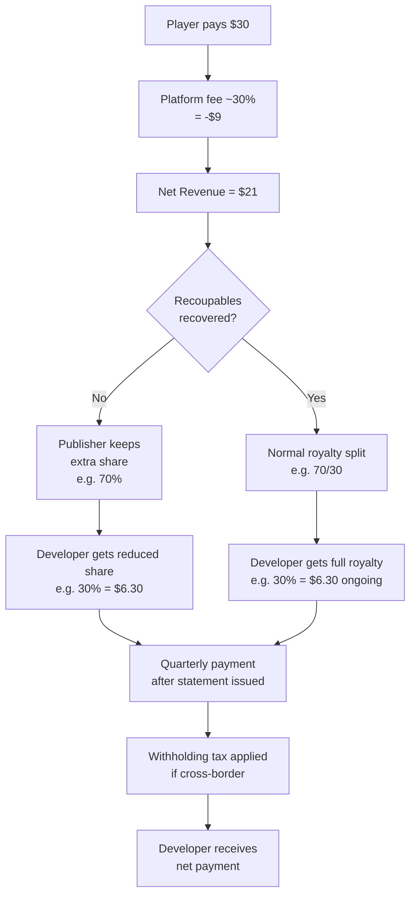

---

## Mind Map — Royalties & Recoupables

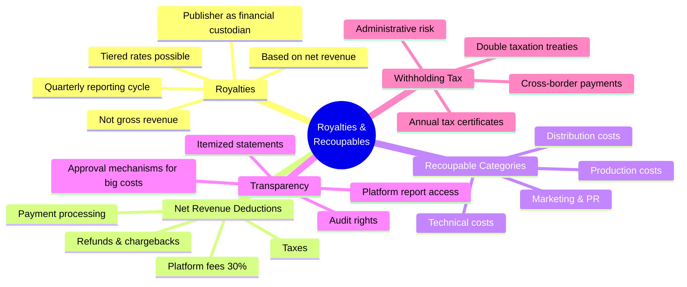

---

## Worked Numeric Example

**Scenario:** Your game earns $100,000 in gross sales on Steam.

| Step | Amount |
|---|---|
| Gross sales | $100,000 |
| Steam platform fee (30%) | -$30,000 |
| **Net Revenue** | **$70,000** |
| Publisher recoups marketing ($20,000) | -$20,000 |
| **Available for royalty split** | **$50,000** |
| Developer royalty (30%) | $15,000 |
| Withholding tax (15% of $15,000) | -$2,250 |
| **Developer actually receives** | **$12,750** |

> **Key insight:** From $100K in sales, the developer receives $12,750 — only 12.75% — because of platform fees, recoupment, and withholding tax. This is why understanding the full financial chain matters.

---

## Quick-Reference Summary Table

| Term | Definition |
|---|---|
| **Gross Revenue** | Total money paid by players |
| **Net Revenue** | Gross minus platform fees, taxes, refunds |
| **Royalty** | Developer's % share of net revenue |
| **Recoupable** | Publisher cost recovered before full royalties begin |
| **Recoupment** | Period when publisher recoups investment from revenue |
| **Withholding Tax** | Tax deducted at source on cross-border payments |
| **Audit Rights** | Developer's right to verify publisher's financial statements |
| **Tiered Royalty** | Royalty % increases when sales hit certain thresholds |

---

# Chapter 13 — Creating a Publishing Contract

> **Core Argument:** A publishing contract converts informal agreements into enforceable commitments. It is not just legal protection — it forces clarity of expectations, establishes processes for handling uncertainty, and defines how value (rights, IP, money) is shared across the entire relationship lifecycle.

---

## Full Slide Content

### The Role of the Publishing Contract
- The contract transforms intent into obligation
- It converts informal agreements into enforceable commitments
- It governs the entire relationship lifecycle
- Covers development, launch, and post-release operations
- It creates structure in an uncertain environment
- Helps manage changes, risks, and evolving conditions

### Why Contracts Matter Beyond Legal Protection
- Forces clarity of expectations
- Reduces misunderstandings between developer and publisher
- Establishes processes for uncertainty
- Defines how to handle delays, changes, and risks
- Provides stability over time
- Maintains alignment even as teams and conditions change

### The Parties and Their Roles
- Clearly define the publisher entity
- Important for financial responsibility and legal accountability
- Clearly define the developer entity
- Determines who is responsible for delivery and compliance
- Identify additional stakeholders
- Includes platform holders, licensors, subcontractors, and investors

### Defining Responsibilities
- Break down responsibilities into specific tasks
- Avoid vague terms such as "handle marketing"
- Define measurable deliverables
- Ensures accountability on both sides
- Align expectations between parties
- Prevents mismatched assumptions

### Grant of Rights — Core Concept
- Defines what the publisher can do with the game
- Includes publishing, marketing, and distribution rights
- Establishes limits of control
- Prevents misuse or overreach
- Represents the most critical section of the contract
- Directly impacts ownership and long-term value

### Key Dimensions of Rights
- Exclusivity: Determines if the developer can work with others
- Platforms: Defines where the game can be released
- Territories: Specifies geographic distribution rights
- Duration: Sets how long rights are granted

### Intellectual Property Ownership
- Determines who owns the game
- Developer ownership is increasingly common
- Defines usage rights
- Covers marketing, merchandise, and adaptations
- Addresses sequels and expansions
- Specifies future rights and obligations

### Financial Framework
- Covers development funding
- Defines how and when the publisher invests
- Specifies recoupment rules
- Determines when developers start earning revenue
- Defines revenue sharing
- Establishes profit distribution after costs

### Revenue and Payment Structure
- Defines what counts as revenue
- Includes platform fees, taxes, and adjustments
- Establishes payment timing
- Typically aligned with platform cycles
- Includes audit rights
- Allows verification of financial accuracy

---

## Mind Map — Publishing Contract Structure

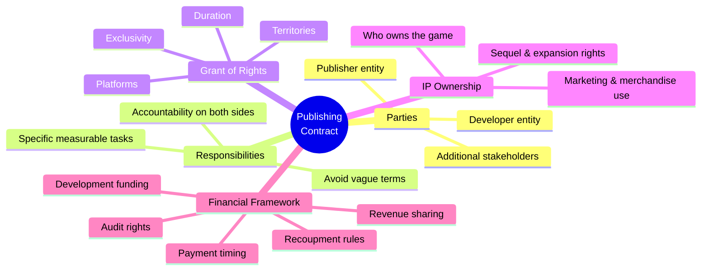

---

## Contract Dimensions Diagram

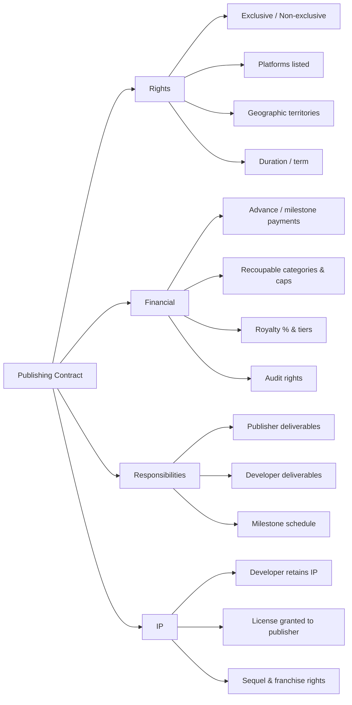

---

## Quick-Reference Summary Table

| Contract Section | Key Question to Answer |
|---|---|
| **Parties** | Who is legally responsible for what? |
| **Grant of Rights** | What can the publisher actually do with the game? |
| **Exclusivity** | Can the developer work with other publishers? |
| **Platforms** | Which platforms can the game be released on? |
| **Territories** | Which countries/regions are covered? |
| **Duration** | How long does the contract last? |
| **IP Ownership** | Who owns the game, characters, and IP after the deal? |
| **Recoupables** | What costs does the publisher recover before royalties? |
| **Audit Rights** | Can the developer verify the financial statements? |

---

## Study Examples

**Example 1 — Vague vs. Specific Responsibilities**
- *Bad contract language:* "Publisher will handle marketing."
- *Good contract language:* "Publisher will deliver: (a) one gameplay trailer by Month 6, (b) Steam store page setup by Month 8, (c) minimum $20,000 in digital advertising in the 30 days before launch."
- Specificity prevents mismatched assumptions.

**Example 2 — IP Ownership Risk**
- Developer signs a deal that gives publisher "all rights to the game and related IP."
- Publisher later creates a sequel without involving the original developer.
- Lesson: always retain IP ownership; grant the publisher a *license* to publish, not full ownership.

---

# Chapter 14 — Building a Brand Around Your Game

> **Core Argument:** In a world where players can instantly evaluate and exit games, marketing alone cannot create success. Branding — a consistent long-term identity — and product quality are what drive discovery and retention. The game trailer is the primary communication tool, and authenticity is non-negotiable.

---

## Full Slide Content

### The Shift from Marketing to Product
- Traditional marketing dominated perception
- Campaigns shaped expectations before gameplay
- Digital distribution changed this dynamic
- Players can instantly evaluate games
- The product now drives visibility
- Quality determines success

### The New Discovery Environment
- Players are always inside storefronts
- No need to be convinced to enter
- Discovery is immediate and competitive
- Players compare multiple games instantly
- Exit is frictionless
- Weak products lose attention quickly

### Role of Creators and Streamers
- Creators replaced traditional media
- They influence discovery and perception
- Authentic recommendations are critical
- Paid promotion is less trusted
- Engagement depends on product quality
- Creators only promote what they believe in

### The Importance of the Game Trailer
- The trailer is the primary communication tool
- Often the first and only impression
- It defines tone and identity
- Shapes perception instantly
- It must communicate value quickly
- Limited time to capture attention

### What Makes a Strong Trailer
- Focuses on clarity
- Clearly explains what the game is
- Prioritizes key features
- Avoids overwhelming the viewer
- Communicates identity
- Shows why the game matters

### Branding vs Marketing
- Marketing is tactical: Short-term actions and campaigns
- Branding is strategic: Long-term identity and consistency
- Strong branding builds trust
- Players recognize and believe in the product

### Visual Identity
- Logo communicates tone and genre
- Typography and color convey meaning
- Key art establishes emotional context
- Creates intrigue and interest
- Consistency builds recognition
- Reinforces identity across platforms

### Messaging and Positioning
- Defines target audience
- Identifies who the game is for
- Establishes differentiation
- Explains what makes it unique
- Communicates core value
- Answers why players should care

### Authenticity in Messaging
- Players verify claims instantly
- Through streams and gameplay
- Overpromising damages credibility
- Creates backlash and distrust
- Honest communication builds trust
- Strengthens long-term relationships

---

## Branding vs Marketing Diagram

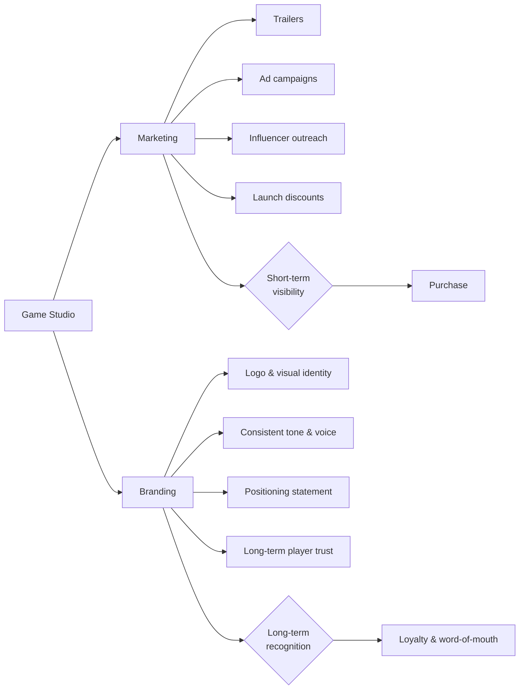

---

## Mind Map — Building a Brand

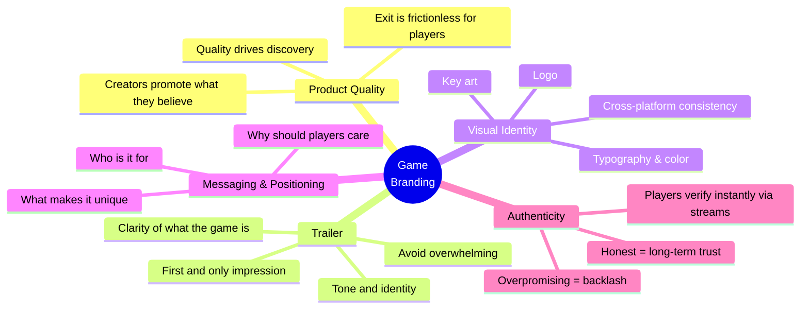

---

## Quick-Reference Summary Table

| Concept | Marketing | Branding |
|---|---|---|
| **Time horizon** | Short-term | Long-term |
| **Nature** | Tactical campaigns | Strategic identity |
| **Goal** | Immediate awareness/sales | Player trust & recognition |
| **Examples** | Trailer, ad, discount | Logo, tone, visual style |

---

## Study Examples

**Example 1 — Strong Trailer Structure (90 seconds)**
1. First 5 seconds: Hook — show the most exciting or unique moment
2. Seconds 5–20: Establish genre and tone
3. Seconds 20–60: Show core gameplay loop clearly
4. Seconds 60–75: Highlight key unique feature
5. Seconds 75–90: Game title, release date, platforms

**Example 2 — Overpromising vs. Authentic Messaging**
- *Overpromising:* "The most immersive open world ever created" → Players stream it, reality doesn't match → backlash, negative reviews
- *Authentic:* "A handcrafted 15-hour narrative RPG with hand-drawn art" → Players know exactly what to expect → positive word-of-mouth

---

# Chapter 15 — Wishlists and the Mispricing of Attention

> **Core Argument:** Wishlists were designed as a player convenience tool, not a business forecasting metric. Treating them as predictive rather than descriptive leads to poor decisions. A wishlist measures attention (a moment of curiosity), not intent (commitment to purchase). Context, trend, and supporting data are what give wishlists meaning.

---

## Full Slide Content

### Wishlists — Original Purpose
- Wishlists were created as a player convenience tool
- They help players remember games they find interesting in large catalogs
- They allow players to bookmark interest without commitment
- Adding a game requires no purchase decision or timing commitment
- They were not designed for forecasting or business analysis
- There was no intention for them to predict demand or revenue

### Why Wishlists Became Important
- Digital distribution removed traditional demand signals
- There are no physical indicators like pre-orders or retail placement
- Developers needed early indicators of market interest
- Decisions must be made before real sales data exists
- Wishlists became one of the few visible pre-launch metrics
- They provided a measurable number during development

### The Misinterpretation Problem
- Visibility is mistaken for reliability
- Just because a number is visible does not mean it is meaningful
- Awareness is mistaken for demand
- Noticing a game is not the same as wanting to buy it
- The metric is overused in decision-making
- Teams rely on it more than it can realistically support
- Core mistake: treating wishlists as predictive instead of descriptive

### What a Wishlist Actually Measures
- A wishlist represents a moment of curiosity
- It captures a player noticing and reacting to a game
- It is a low-effort action
- Players can add a game without thinking deeply about it
- It does not measure commitment
- There is no obligation to return or purchase
- Wishlists measure attention, not intent

### Wishlists as a Conditional Signal
- Wishlists are useful only when interpreted carefully
- They require supporting data
- They reflect attention under specific conditions
- They depend on timing and context
- They do not validate success
- They only indicate that a game was noticed

### Reading Wishlists Correctly
- Wishlists should be combined with other signals
- Such as demos, engagement, and marketing performance
- Growth should be analyzed relative to exposure
- Interest must be evaluated in context
- Focus should be on current behavior
- What matters is what is happening now
- **Key idea: context gives meaning to the metric**

### The Problem of Time
- Wishlists accumulate over long periods
- A game may collect wishlists over months or years
- Player preferences and market conditions change
- Trends, competition, and tastes evolve over time
- Older wishlists may no longer reflect interest
- What was exciting before may not be relevant now

### Aggregation Creates False Signals
- Old and new wishlists are combined into one number
- There is no distinction between recent and outdated interest
- This creates the illusion of continuous demand
- Growth appears stable even if interest has declined
- The number appears stronger than it actually is
- It exaggerates perceived market traction

### The Illusion of Momentum
- Increasing wishlist numbers appear as progress
- Teams interpret growth as success
- Growth may reflect past exposure, not current interest
- Earlier marketing campaigns may still influence the number
- Momentum may not exist in the present
- The game may no longer be gaining real attention

### Impact on Development Decisions
- Teams begin optimizing for wishlist growth
- Marketing focuses on what increases numbers
- Changes are avoided to protect the metric
- Developers fear disrupting growth patterns
- Product quality may suffer
- Decisions are driven by perception rather than improvement
- Risk: metrics shape behavior negatively

### Wishlists and Negotiation Power
- Developers believe large numbers create leverage
- They assume publishers will value high totals
- Publishers focus on recent trends and engagement
- They look at how fast interest is growing now
- Static numbers have limited influence
- Historical data does not create urgency
- Leverage comes from current momentum, not totals

---

## Wishlist Reality Diagram

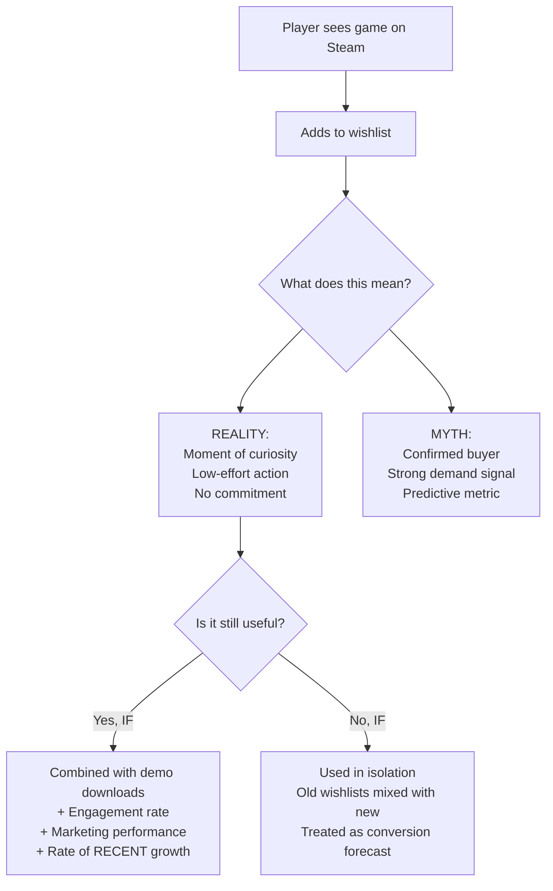

---

## Mind Map — Wishlists

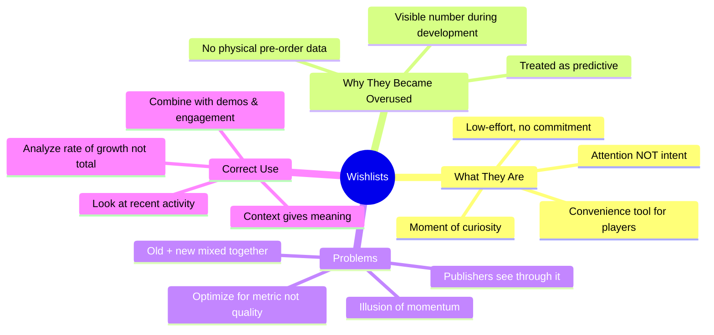

---

## Quick-Reference Summary Table

| | Wishlist | Strong Signal |
|---|---|---|
| **Measures** | Attention | Intent to purchase |
| **Commitment level** | Zero | High (e.g., pre-order, demo download) |
| **Time sensitivity** | Decays — old ones lose meaning | Recent data matters more |
| **Useful when...** | Combined with other signals | — |
| **Not useful when...** | Used in isolation as forecast | — |
| **Publisher reaction** | Focus on trend, not total | Engaged community, demo plays |

---

## Study Examples

**Example 1 — The Wishlist Trap**
- A game accumulates 80,000 wishlists over 3 years of slow development.
- Team believes they have a guaranteed audience.
- On launch: only 2,000 sales. Why?
  - Many wishlists are 2-3 years old — those players moved on
  - The genre trended down
  - No recent marketing → no current momentum
  - Wishlist growth had flatlined for 12 months

**Example 2 — Using Wishlists Correctly**
- A game gets 5,000 wishlists in 2 weeks after a Steam Next Fest demo.
- The team also tracks: 30% demo-to-wishlist conversion rate, 500 Discord joins, active comments.
- *This* is a meaningful signal — recent, high engagement, multi-metric validation.

---

# Chapter 17 — Platform Strategies: Where to Publish Your Game

> **Core Argument:** Platforms are not neutral delivery channels — each one shapes player behavior, visibility, and revenue. Platform selection is a strategic business decision. Success depends not just on being available somewhere, but on being placed correctly in the right ecosystem for your game's audience.

---

## Full Slide Content

### Evolution of Distribution
- Physical distribution relied on logistics → Shipping, retail placement, and geography determined success
- Digital distribution removed these barriers → Games can now reach global audiences instantly
- The constraint shifted to visibility → The challenge is now being seen, not being delivered

### The New Distribution Problem
- Supply of games is effectively unlimited → Thousands of games are released every year
- Attention is the scarce resource → Players cannot see or evaluate everything
- Success depends on visibility → Being discovered is more important than being available

### Distribution as Strategic Placement
- Games are not simply released → They are strategically positioned within platforms
- Timing and context affect success → Launch timing influences visibility and competition
- Placement determines exposure → Platform systems decide who sees the game

### Personal Computer Platforms Are Not One Market
- Different platforms serve different audiences → Each has unique behaviors and expectations
- Platforms operate differently → Algorithms, features, and policies vary
- Strategic selection is required → Choosing the wrong platform reduces performance

### Steam — The Default Platform
- Largest audience base → Provides access to a massive player community
- Strong infrastructure → Includes reviews, achievements, and recommendation systems
- High competition → Many games compete for limited visibility

### Steam Strategy — Momentum
- Steam rewards early performance → Strong launch activity increases visibility
- Algorithms prioritize engagement → Reviews and purchases drive discovery
- Marketing must be concentrated → Success depends on focused attention at launch

### Epic Games Store — Risk Strategy
- Offers lower revenue share → Developers retain more income per sale (12% vs 30%)
- Provides financial guarantees → Reduces uncertainty for developers
- Trade-off is reduced reach → Smaller audience compared to Steam

### GOG — Audience Fit Strategy
- Smaller but more specialized audience → Players prefer specific types of games (classic, DRM-free)
- Strong alignment is required → Games must match audience expectations
- Less competition improves visibility → Fewer games compete for attention

### Layered Personal Computer Strategy
- Distribution includes multiple channels → Platforms, direct sales, and experimental spaces
- Each channel serves a purpose → Testing, pricing, or revenue optimization
- Strategy is not about being everywhere → It is about being in the right places

### Console Publishing Reality
- Consoles are controlled ecosystems → Platform holders manage access and standards
- Certification is required → Games must meet technical requirements
- Timing is critical → Delays affect marketing and release plans

### Console Platform Differences
- PlayStation emphasizes quality and polish → Players expect high production value
- Xbox focuses on subscription models → Revenue may come from platform deals (Game Pass)
- Nintendo prioritizes gameplay fit → Games must suit the platform experience

### Mobile Platforms
- Apple users spend more on average → Higher revenue per player
- Android offers larger reach → Greater number of users globally
- Discovery is driven by performance marketing → Success requires advertising investment

### Subscription Models
- Access replaces ownership → Players pay for access to many games
- Games compete for time, not purchases → Engagement becomes more important than sales
- Design priorities shift → Games must capture attention quickly

### Strategic Trade-Offs
- Exposure versus certainty → Large audience versus guaranteed revenue
- Reach versus alignment → Broad visibility versus audience fit
- Risk versus reward → Uncertain success versus stable outcomes

### Final Strategic Insight
- Platforms are not neutral environments → Each shapes player behavior and outcomes
- Platform choice affects success before launch → Decisions determine visibility and performance
- Distribution is a strategic decision → Not just a technical step

### Key Takeaway
> "A game succeeds not just because it exists, but because it is placed correctly"

---

## Mind Map — Platform Strategies

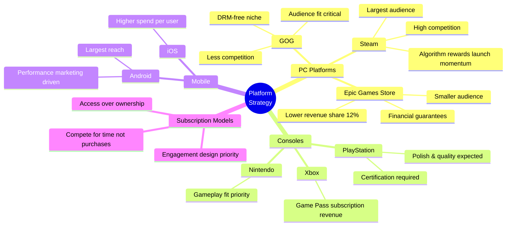

---

## Platform Trade-Off Matrix

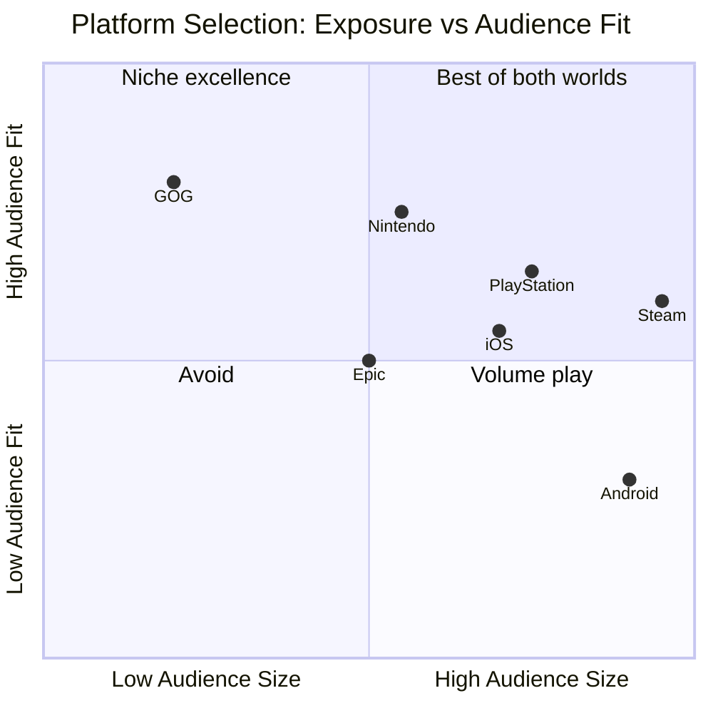

---

## Quick-Reference Summary Table

| Platform | Revenue Share | Audience | Best For |
|---|---|---|---|
| **Steam** | 70/30 | Massive | Most PC games, momentum-dependent |
| **Epic Games Store** | 88/12 | Medium | Revenue certainty, guaranteed deals |
| **GOG** | ~70/30 | Small/niche | DRM-free, classic game enthusiasts |
| **PlayStation** | ~70/30 | Large console | Polished, AAA-adjacent titles |
| **Xbox/Game Pass** | Deal-based | Large console | Subscription revenue model |
| **Nintendo Switch** | ~70/30 | Dedicated | Gameplay-first, indie-friendly |
| **iOS** | 70/30 | High-spend mobile | Premium or F2P with high ARPU |
| **Android** | 70/30 | Massive mobile | Broad reach, performance marketing |

---

## Study Examples

**Example 1 — Niche Indie Puzzle Game**
- Best platform: GOG + Steam (secondary)
- Why: Puzzle game enthusiasts overlap strongly with GOG's DRM-free audience. Steam as primary for reach. Avoid mobile (wrong audience).
- Strategy: focus launch momentum on Steam with concentrated marketing, use GOG for long-tail sales.

**Example 2 — Action RPG with Large Budget**
- Best platform: Steam (PC), PlayStation (console), potential Xbox Game Pass deal
- Why: Large audience needed to recoup budget. PlayStation audience expects polished action RPGs. Game Pass provides guaranteed revenue floor.
- Strategy: simultaneous multi-platform launch, coordinated marketing.

---

# Chapter 19 — Preparing for Launch

> **Core Argument:** A game launch is not a date — it is a test of the entire organization. Strong technical preparation, coordinated marketing, community infrastructure, and fast-response systems determine launch quality. Plans must be flexible because real conditions always differ from preparation.

---

## Full Slide Content

### Launch Is Not a Date — It Is a Company Test
- A launch tests the whole organization: development, QA, marketing, PR, community, support, sales, and leadership
- A strong game can fail if the launch system is weak; launch quality depends on preparation, coordination, and fast response
- The chapter presents a maximalist launch model: not every indie team can do everything, but every team should scale the principles
- The core lesson is flexibility: plans rarely survive first contact with players, platforms, press, and technical reality

### The Cross-Functional Launch Framework
- Many launch failures happen because planning stays inside marketing until too late
- Cross-functional launch teams surface hidden risks early: technical capacity, certification issues, messaging problems, support load, and community expectations
- The meeting cadence should tighten as launch approaches: monthly at six months, weekly at three months, and daily during the final critical weeks

### Meeting Cadence: From Early Planning to Daily Stand-ups
- 6 months out: monthly coordination sessions to identify requirements, dependencies, and major blockers
- 3 months out: weekly sessions to pressure-test the plan, review assets, track certification, and refine marketing timing
- Final weeks: daily stand-ups to resolve immediate blockers and manage fast-changing launch risks
- Purpose: track launch readiness and catch small issues before they become launch delays or public failures

### Technical Preparation: The Foundation of Player Experience
- Technical stability is the minimum threshold: players cannot appreciate design if the game fails to run, connect, or perform
- Final candidate builds should be ready at least four weeks before release to allow certification, testing, and fixes
- Platform certification is often underestimated; multiple submissions can add days or weeks
- Physical components add hard deadlines through manufacturing lead times; digital-only releases are more flexible but still require discipline
- Launch testing must approximate real player conditions, not only controlled development environments

### Graduated Online Testing: Do Not Discover Scale Problems at Launch
- Technical Test: core systems, matchmaking
- Closed Beta: integrated, select players
- Open Test: near launch, scale pressure
- Launch: public, monitoring
- Online games require staged population testing. If problems emerge only in open testing, teams can focus on scale, capacity, and infrastructure

### Build and Version Management: Protect the Launch Branch
- As launch approaches, development must separate stability from future ambition
- Launch branch: only critical fixes that protect certification and player experience
- Post-launch update branch: important but non-critical improvements planned after release
- Feature branch: longer-term development that should not destabilize the release candidate
- Poor branch discipline can introduce new bugs during the period when stability matters most

### Marketing Orchestration: Building Anticipation Without Exhausting Interest
- Marketing begins four to six months before launch because platform featuring, press outreach, and ad placements require long lead times
- Core assets — key art, trailers, store copy, screenshots, and messaging — express the game's market identity
- Asset rollout should build momentum: teaser → feature trailer → gameplay demonstration → launch conversion
- Marketing must be aligned with the actual game: overpromising creates backlash; underexplaining reduces conversion

### Store Presence Optimization: Each Platform Has Its Own Discovery Logic
- Steam: keywords, strong opening seconds in trailers, compelling descriptions, screenshot progression, and search visibility
- Mobile stores: icons, feature graphics, short appeal window, quick clarity, and conversion from minimal visual space
- Console stores: category placement, platform features, curated visibility, and audience fit
- Do not duplicate the same store page everywhere; user expectations differ by platform
- Store optimization directly affects discoverability and conversion

### Pricing and Promotion: More Than a Number
- Pricing should be finalized about three months before launch to coordinate platforms, retail partners, and marketing cadence
- Regional pricing requires local purchasing power, competition, platform norms, and market expectations — not simple currency conversion
- Launch discounts can increase volume but may weaken perceived value or anchor the game at a lower price
- For games with post-launch monetization, early offers establish expectations about fairness, value, and future spending

### Community and Support Infrastructure: Prepare Before Players Arrive
- Modern launch is an ongoing conversation, not a one-time transaction
- Knowledge bases should answer likely issues from beta feedback, QA findings, and comparable games
- Ticket systems need categories, priority levels, escalation paths, and response-time expectations
- Social monitoring should detect sentiment shifts, volume spikes, influencer amplification, and emerging problems before formal tickets rise
- Support systems themselves must be tested under expected launch traffic

### Press, Influencers, Review Codes, and Embargoes
- Review code is often sent two to four weeks before launch to allow evaluation while keeping coverage close to purchase timing
- Embargoes create fair evaluation conditions and coordinate visibility before release
- Influencers require different support: streaming permissions, content guidelines, clip-worthy moments, and technical capture support
- Disclosure and authenticity matter: marketing control should not damage audience trust
- Reviewer selection should match the game: genre expertise can matter more than audience size

### Beta and Early Access: Feedback, Community, and Risk
- Beta programs validate technical performance, player experience, community building, and marketing momentum
- Expectation-setting is critical: players must know what is unfinished, what feedback matters, and how feedback may be used
- Structured feedback includes bug reports, session analytics, surveys, and community discussion
- Early access can turn players into champions when they see their feedback influence development
- Risks: negative impressions, unclear roadmaps, overpromising, and failing to polish before full launch

### Launch Day Execution: When Planning Becomes Active Management
- Launch day requires hour-by-hour scheduling for external communications and internal operations
- Promotional posts, community engagement, support coverage, and time zones must be coordinated
- Technical monitoring needs assigned responsibilities for servers, matchmaking, client performance, crashes, payments, and platform issues
- Escalation thresholds should be predetermined so decisions are not made emotionally under pressure
- Contingency plans should include issue categories, response protocols, owners, and public messaging responsibilities

### Post-Launch Monitoring: Transitioning into Live Operations
- Post-launch monitoring tracks four dimensions: technical stability, player behavior, commercial performance, and community sentiment
- Alert thresholds help teams investigate abnormal changes quickly rather than relying on intuition
- Data reveals both problems and opportunities that were invisible during development
- A smooth launch is not the end; the game enters a live relationship with players
- Systematic preparation outperforms heroic effort: luck favors prepared teams

### Strategic Release Timing: Choosing a Window of Opportunity
- The right game can fail in the wrong window due to competitive crowding, seasonality, platform priorities, and media cycles
- Titanfall 2 shows the risk of launching between major competitors; attention and budgets are finite
- Counter-programming can help smaller games by launching during quieter periods, as Apex Legends did in February 2019
- Platform holders have calendars and may support games that fill portfolio gaps
- Timing is risk management, not certainty; avoid clearly bad windows and match timing to audience behavior

### Pre-Orders, First Impressions, Recovery, and Flexibility
- Pre-orders are strongest for AAA franchises; smaller teams should use them carefully because operational costs may exceed benefits
- Incentives should avoid pay-to-win dynamics; cosmetics, early access windows, or convenience items are safer
- First impressions form through installation, onboarding, early performance, tutorial pacing, and first gameplay moments
- Troubled launches can recover through transparent communication, clear roadmaps, community engagement, focus on core issues, and persistence
- Final lesson: perfection is impossible; adaptability, honesty, and commitment determine recovery potential

---

## Launch Timeline Diagram

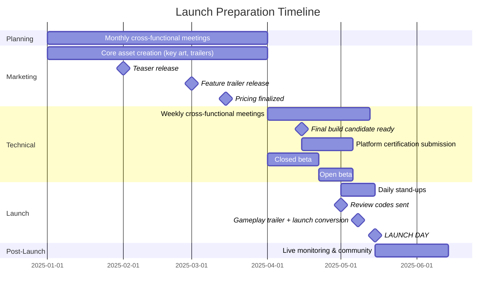

---

## Build Branch Management Diagram

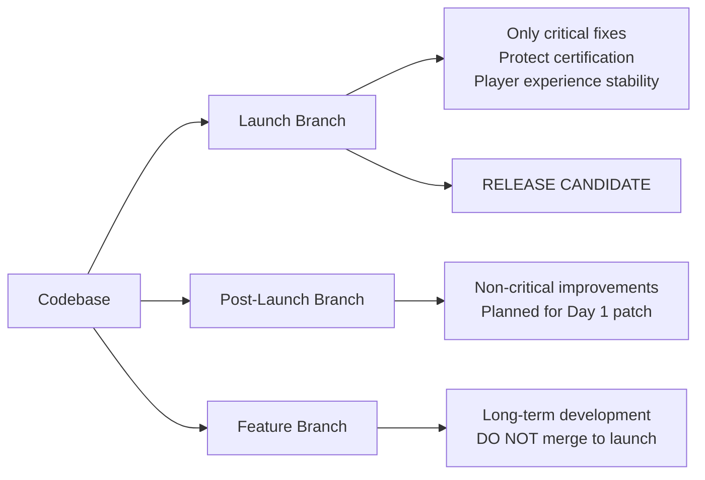

---

## Mind Map — Launch Preparation

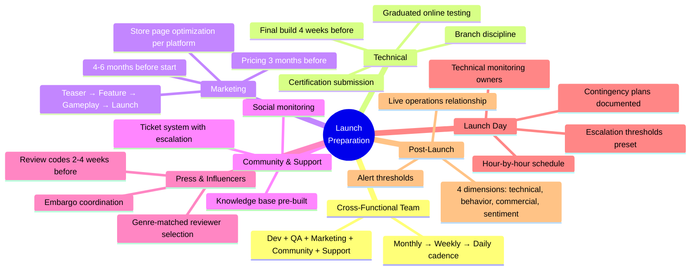

---

## Quick-Reference Summary Table

| Phase | Timing | Key Actions |
|---|---|---|
| **Early planning** | 6 months out | Monthly meetings, identify requirements |
| **Pre-production marketing** | 4-6 months | Core assets, teaser, platform outreach |
| **Pricing finalized** | 3 months | Regional pricing, retailer coordination |
| **Active preparation** | 3 months | Weekly meetings, pressure-test plan |
| **Technical lock** | 4 weeks | Final build, certification submission |
| **Review codes** | 2-4 weeks | Press & influencer outreach |
| **Final sprint** | Last weeks | Daily stand-ups, open beta |
| **Launch day** | Day 0 | Hour-by-hour execution, monitoring |
| **Post-launch** | Ongoing | Live ops, 4-dimension monitoring |

---

## Study Examples

**Example 1 — Titanfall 2 Timing Mistake**
- Titanfall 2 launched between Battlefield 1 and Call of Duty: Infinite Warfare in October 2016.
- Both competitor games had massive marketing budgets and dedicated audiences.
- Result: Titanfall 2 was critically acclaimed but commercially underperformed.
- Lesson: even great games fail in wrong windows. Timing is risk management.

**Example 2 — Troubled Launch Recovery**
- A game launches with server instability: 40% of players cannot connect.
- Strong recovery path: immediate transparent developer post (acknowledge, no excuses), clear fix timeline, compensation for affected players (free DLC), daily community updates until resolved.
- Games that communicate honestly and fix quickly can recover; games that go silent do not.

---

# Chapter 20 — Working with International Markets

> **Core Argument:** International publishing requires far more than translation. Localization adapts language, culture, UX, monetization, and community expectations to make the experience understandable and commercially viable in each market. The goal is not to erase the game's identity, but to remove friction that blocks comprehension or acceptance — while preserving elements that create perceived value.

---

## Full Slide Content

### International Markets: Beyond Translation
- Global publishing requires more than converting text from one language to another
- Translation preserves literal meaning; localization adapts language, culture, visuals, UX, gameplay explanation, monetization, and expectations
- Players interpret games through local cultural frameworks: humor, symbols, spending norms, social identity, and platform habits
- The goal is not to erase the game's identity; it is to make the experience understandable, respectful, and commercially viable in each market

### The Adaptation Spectrum: What Should Change and What Should Stay?
- Different game elements need different levels of adaptation
- **High adaptation:** idioms, jokes, cultural references, character names, historical meanings, tutorials, store copy
- **Medium adaptation:** UI layout, font legibility, text space, payment methods, event calendars, support workflows
- **Low adaptation:** core gameplay identity, brand-defining mechanics, elements players value as authentic
- The best strategy protects creative identity while adapting friction points that block comprehension or acceptance

### Case Lesson: Korean RollerCoaster Tycoon 3 and Brand Authenticity
- A fully localized Korean logo seemed logical, but it removed the Western authenticity players valued
- Sales improved after restoring original branding assets, showing that not every foreign element should be localized
- Apple's Asian market approach similarly preserves English logos and key identity signals to maintain desirable global brand meaning
- Lesson: localize what blocks understanding; preserve what creates perceived value, prestige, or authenticity

### Technical Foundations for Global Reach
- Internationalization should be built early: separating text from code, flexible UI containers, modular regional assets, and context notes
- Retrofitting localization after development creates cost, bugs, UI problems, and weaker language quality
- Glossaries and translator notes are essential for narrative-heavy games where tone and meaning matter
- Flexible architecture allows regional changes without rebuilding the entire game
- Technical readiness is a business enabler: it reduces friction, cost, and time-to-market

### Voice, Dialogue, and Gameplay Adaptation
- Voice localization can range from subtitles only to full voice replacement depending on market importance and budget
- God of War III in Japan used full Japanese voice replacement and culturally adapted dialogue for stronger emotional resonance
- Hybrid approaches are often practical: localize main characters and key scenes, subtitle secondary content
- Gameplay adaptation may be needed when market preferences differ, as with Chinese adaptations of Counter-Strike-like experiences
- Adaptation should preserve function: change presentation or systems enough to improve fit without breaking the core game

### Cultural Sensitivity Review: Risk Prevention and Respect
- Cultural review examines religious references, historical interpretation, political sensitivity, gestures, symbols, stereotypes, and regional norms
- This review should involve people who deeply understand both source and target cultures
- The goal is not to sanitize everything, but to preserve the intended function in a culturally appropriate way
- Poor review can create controversy, bans, poor reviews, or loss of trust
- Good review improves both market access and player respect

### Business Model Adaptation: Monetization Must Fit Local Behavior
- Markets differ in price sensitivity, preferred payment methods, spending habits, and attitudes toward monetization
- Riot's League of Legends expansion in Southeast Asia adapted pricing tiers, payment methods, and monetization emphasis
- Some regions value cosmetics; others value status markers, achievements, or social visibility
- Direct currency conversion often fails because purchasing power and competitive conditions differ
- Payment method integration can matter as much as price: users must be able to pay in familiar local ways

### Local Partnerships and Staged Internationalization
- Partnerships can provide regulatory knowledge, distribution access, payment integration, marketing relationships, and live operations support
- Some markets, especially China, effectively require local publishing partners
- Staged expansion builds capability: linguistically similar markets first, then broader language adaptation, then culturally complex markets
- Partnerships should transfer knowledge, not just outsource responsibility
- The best partner depends on game type, audience, business model, and adaptation needs — not just size

### China: Opportunity with High Regulatory Complexity
- China offers massive scale but has one of the most complex regulatory environments in games
- Commercial release requires approval through the National Press and Publication Administration (NPPA)
- Approval can take months, especially for foreign titles, and may be affected by freeze periods
- Regulation covers content, player protection, data, monetization, technical implementation, and publishing structure
- Unprepared publishers face delays, rework, or blocked market entry

### Western vs. Eastern Markets: Platform and Genre Differences
- Western markets are relatively balanced across PC, console, and mobile; Eastern markets often have stronger mobile dominance, especially China and South Korea
- Japan remains strong in mobile and console but has less PC dominance than some other developed markets
- Western markets often favor action-adventure, FPS, open-world, sports, and individual agency
- Eastern markets often show strong engagement with MOBAs, character collection RPGs, auto battlers, and social/strategic experiences
- Platform and genre choices should match market realities, not home-market assumptions

### Western vs. Eastern Markets: Monetization, Community, and Aesthetics
- Western players often resist pay-to-win, aggressive gating, or power sold directly
- Eastern markets may accept more spending-linked progression but expect generous events, social status markers, and visible advancement
- Community identity can be more deeply tied to gaming status in China and South Korea
- Aesthetic preferences differ: Western traditions often emphasize realism, while Eastern traditions often favor stylized characters and emotional visual qualities
- Successful adaptation treats monetization and aesthetics as part of the gameplay experience

### Emerging Market Focus: Latin America
- Latin America is accessible for Western publishers but still requires regional adaptation
- Pricing must reflect lower average disposable income; simple exchange-rate conversion often limits reach
- Regional pricing on platforms like Steam can dramatically expand the addressable market
- Influencer marketing and local creators often outperform translated global campaigns
- Payment, language, and local community expectations still vary by country, especially Brazil versus Spanish-speaking markets

### Emerging Market Focus: Southeast Asia
- Southeast Asia is large and fragmented: Indonesia, Thailand, Vietnam, Philippines, Malaysia, Singapore, and others differ sharply
- Mobile dominates because of smartphone adoption, historical console limitations, and infrastructure patterns
- Payment fragmentation is critical: GCash, Maya, TrueMoney, DANA, OVO, telecom billing, and local wallets affect conversion
- Local publishers such as Garena and VNG can provide marketing, payments, compliance, and community capabilities
- Live operations expectations are intense: frequent events, fast response, and culturally relevant content drive retention

### MENA: The Underserved Growth Opportunity
- MENA offers high growth potential but remains underserved compared with its gaming audience size and engagement
- Arabic localization must handle dialects, terminology, UI readability, marketing tone, and audience expectations — not just Modern Standard Arabic
- Cultural adaptation requires nuance: religious references, relationships, history, representation, and authenticity must be handled carefully
- Payments differ across the region: STC Pay, Fawry, telecom billing, vouchers, and wallets may outperform international-only methods
- Regulation varies by country; Saudi Arabia has formal game regulation through GCAM

### Final Synthesis: Global Publishing as Strategic Learning
- International expansion is not only new revenue; it creates competitive insight into future gaming trends
- Emerging markets often pioneer behaviors that later influence global play: mobile-first habits, social integration, live events, and alternative payments
- Authentic regional respect improves market fit and can strengthen creative quality across all markets
- The exam lens: identify what changes by market — language, culture, regulation, payment, platform, monetization, community, and operations
- The strongest publishers treat international markets as long-term relationships, not one-time distribution targets

---

## Adaptation Spectrum Diagram

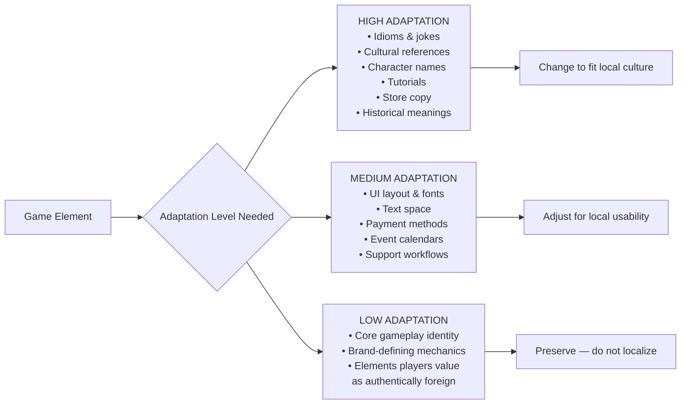

---

## Mind Map — International Markets

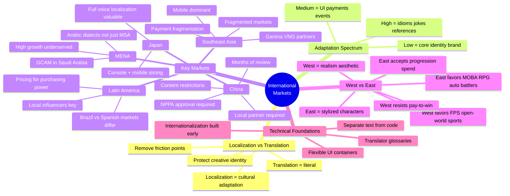

---

## Regional Comparison Table

| Region | Platform | Genre Preference | Monetization | Key Challenge |
|---|---|---|---|---|
| **Western (US/EU)** | PC + Console balanced | FPS, Open World, Sports | Cosmetics, DLC, no P2W | High competition, saturation |
| **China** | Mobile dominant | MOBA, RPG, Social | Gacha, progression, events | NPPA approval, regulations |
| **Japan** | Mobile + Console | JRPG, Mobile RPG | Gacha, character collect | Full localization expected |
| **South Korea** | PC + Mobile | MOBA, Battle Royale | Status markers, social | Community identity is intense |
| **Southeast Asia** | Mobile first | MOBA, Casual | Payment fragmentation | Many local payment methods |
| **Latin America** | PC + Mobile | Varied | Price-sensitive | Exchange rate pricing |
| **MENA** | Mobile + Console | Action, Sports | Growing spend | Arabic dialects, GCAM regs |

---

## Study Examples

**Example 1 — RollerCoaster Tycoon 3 in Korea**
- Decision: fully localize the logo into Korean characters
- Result: sales dropped — Korean players valued the Western brand authenticity
- Fix: restore original English branding
- Lesson: not every foreign element should be adapted. Some foreign elements *are* the product's perceived value.

**Example 2 — Riot Games in Southeast Asia (League of Legends)**
- Adapted: pricing tiers, accepted local payment methods (GCash, telecom billing), emphasized social status markers over pure cosmetics
- Did not adapt: core gameplay mechanics, champion design philosophy
- Result: massive growth across Philippines, Indonesia, Thailand
- Lesson: adapt the business model and friction points, not the core creative identity.

**Example 3 — Entering China Without Preparation**
- Studio submits to NPPA without understanding regulations
- Game contains content that requires removal (certain historical references, blood effects)
- Approval delayed 18 months, competitor games captured market
- Lesson: treat China as a separate long-lead project, not an afterthought. Plan 2+ years in advance.

---

# Quick Revision — All Chapters at a Glance

| Chapter | Title | One-Sentence Core |
|---|---|---|
| **7** | The Scout's Checklist | Publishers evaluate games on 5 criteria: Concept, Team, Audience, Business Strategy, Community/IP |
| **8** | Timing Your Approach | When you pitch matters as much as what you pitch — before vs. after announcement creates different leverage |
| **11** | Royalties & Recoupables | The full revenue chain (platform fees → recoupment → royalties → withholding tax) determines what developers actually earn |
| **13** | Publishing Contract | Contracts force clarity on rights, responsibilities, IP ownership, and financial structure |
| **14** | Building a Brand | Product quality drives discovery; branding (long-term identity) beats marketing (short-term campaigns) |
| **15** | Wishlists | Wishlists measure attention, not intent — they are descriptive not predictive; use alongside other signals |
| **17** | Platform Strategies | Platform selection is strategic — each platform shapes visibility, audience, and revenue differently |
| **19** | Preparing for Launch | Launch is a company-wide test; systematic preparation (timeline, technical, marketing, support) beats heroic effort |
| **20** | International Markets | Localization adapts culture/UX/monetization; preserve core identity while removing friction points |

---

*Study guide compiled from ENTR 410 lecture slides — Chapters 7, 8, 11, 13, 14, 15, 17, 19, 20*
